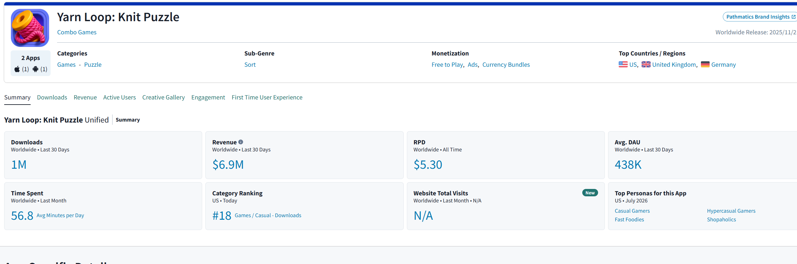
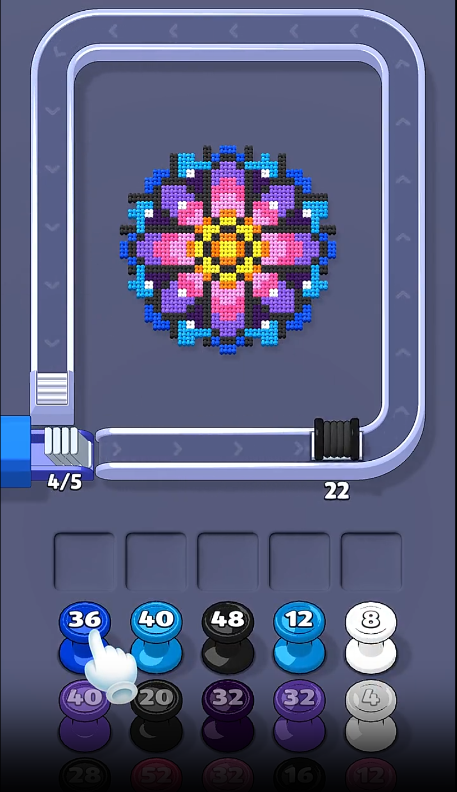
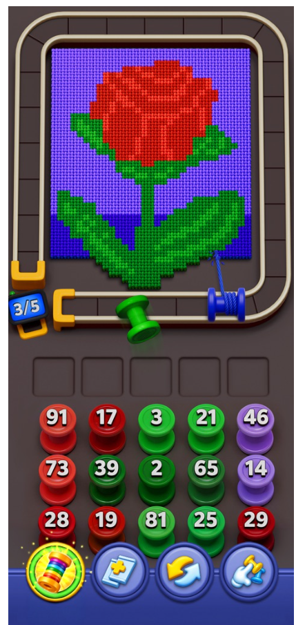
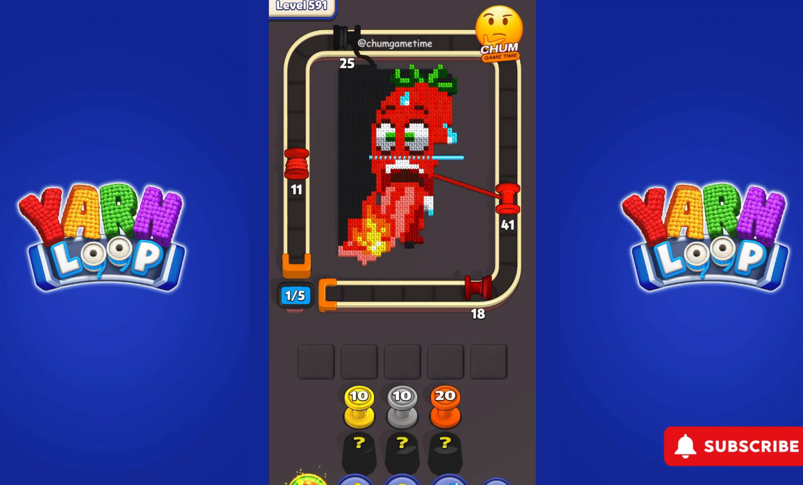
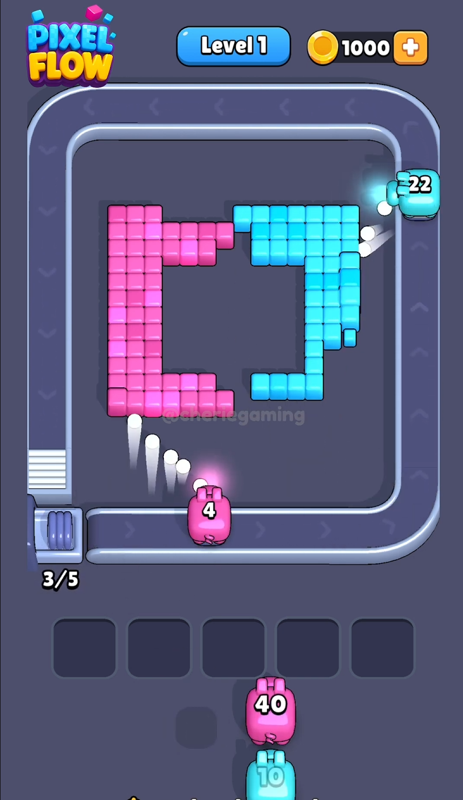
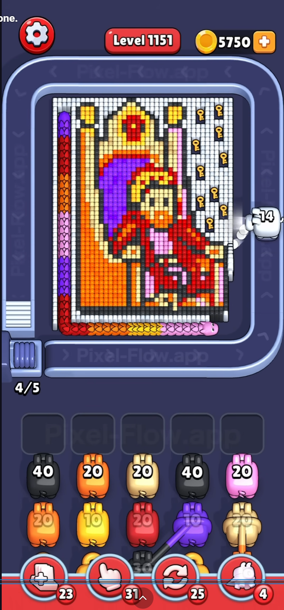
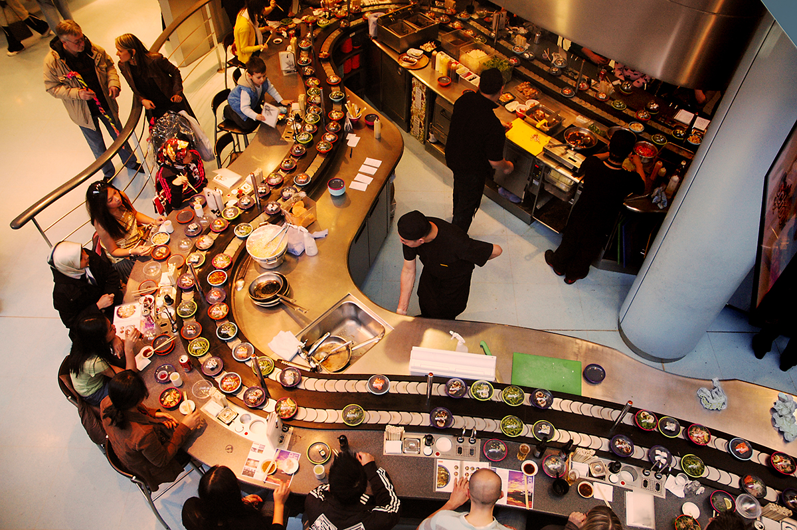
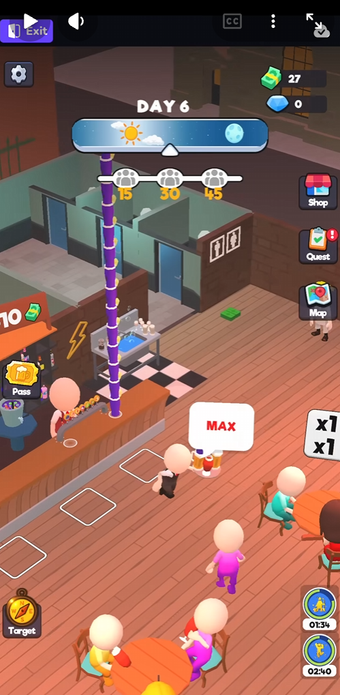
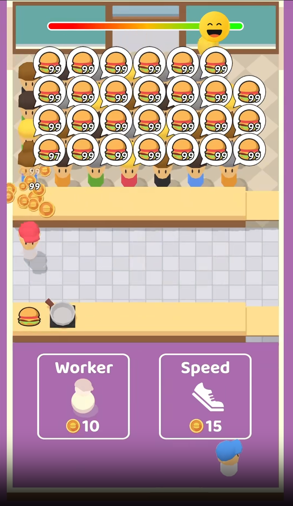

# Restaurant Loop (Working Title)

This is a structured English translation of the nine-page Turkish GDD. The
source PDF remains the source of truth. This file must be updated whenever the
source checksum changes.

## Project Snapshot

- Genre: conveyor-and-queue sorting puzzle.
- Platform: Android APK.
- Orientation: portrait.
- Scope: core mechanic, Yarn Loop-derived power-ups, 30 original levels, table
  groups, main menu, tutorial, fail/retry/win flows, and level validation.
- Bonus after the core: timed customers.
- Primary motivation: completion - the crowd visibly dissolves and the
  restaurant becomes clean and empty.
- Secondary motivation: light strategy through conveyor timing and rack
  management.
- Intentionally low emphasis: fantasy and story.
- Creative message: **Feed everyone. Empty the restaurant.**

## Authority of References

- Yarn Loop is the primary mechanical reference for conveyor timing, queue,
  rack reuse, capacity, failure, power-ups, submechanics, level flow, and the
  rhythm of difficulty.
- Pixel Flow is a cross-check when Yarn Loop behavior remains ambiguous.
- Bar Rumble is a feel reference for carrying and dropping a swaying stack. Its
  mechanics are not copied.
- Eatventure is a creative-format reference for a waiting crowd with order
  balloons. Its tycoon gameplay is not copied.
- The inversion, balloon contract, restaurant presentation, and table/timed
  customer rules in this document override reference behavior.
- Level layouts must be original. No reference level may be copied one-to-one.

The source says unspecified system behavior should copy Yarn Loop. The project
owner has added a stricter governance rule: observed behavior must be recorded
and explicitly confirmed before implementation. See `../01-PROJECT-RULES.md`.

## 1. The Game in Three Sentences

A crowd of waiting customers occupies the middle of the screen, each with an
order balloon, while a conveyor loops around them. The player taps a numbered
food stack at the front of the queue to deploy it; while circling, it serves
matching customers on the exposed edge, throwing a plate or container in an
arc so the customer eats, celebrates, and leaves. An empty stack ejects its
tray, an unfinished stack moves to the reusable rack, a deadlocked full rack
causes failure, and clearing the restaurant wins the level.

## 2. Reference Set and Visual Evidence

### Yarn Loop market signal

- Visible evidence: a Sensor Tower-style dashboard for Yarn Loop. The document
  cites approximately $6.9M revenue/30 days, 1M downloads/30 days, $5.30 RPD,
  438K DAU, and 56.8 minutes per user/day as of August 2026.
- Permitted inference: the GDD uses this as evidence that the conveyor-and-queue
  subgenre is commercially active.
- Not established: gameplay rules, retention causality, or future market
  performance.

### Yarn Loop gameplay hierarchy

- Visible evidence: central mass, rectangular loop, `4/5` capacity indicator,
  five empty rack slots, and a multi-row queue of numbered colored spools.
- Permitted inference: broad portrait composition and information hierarchy.
- Not established: stop/slow timing, input behavior, failure delay, or power-up
  functionality.

- Visible evidence: `3/5` capacity, conveyor units, five rack slots, visible
  queue depth, and four distinct power-up icons.
- Permitted inference: rack and queue remain simultaneously visible; colors and
  counts are redundant identifiers.
- Not established: what any power-up does or when it is introduced.

- Visible evidence: a character-shaped dense mass inside the same conveyor and
  lower-screen queue/rack grammar.
- Permitted inference: the mechanic supports varied central silhouettes while
  retaining a stable UI frame.
- Not established: level progression rules or exact motion.

### Pixel Flow cross-check

- Visible evidence: early level, `3/5` capacity, five rack slots, central colored
  mass, and numbered units that act toward the mass.
- Permitted inference: Yarn Loop and Pixel Flow share a recognizable system
  grammar.
- Not established: Restaurant Loop serving behavior.

- Visible evidence: late-game density, `4/5` capacity, deeper queue, five rack
  slots, blocker/key elements, and four power-up icons with inventory counts.
- Permitted inference: later difficulty can come from density, reveal order,
  blockers, and rack pressure.
- Not established: which Pixel Flow submechanics belong in Restaurant Loop.

### Theme and service feel

- Visible evidence: warm lighting, crowded counter seating, abundant plates,
  and a real-world moving-food service context.
- Permitted inference: food-court warmth, appetizing abundance, and social
  density.
- Not established: literal camera, floor plan, or visual style.

- Visible evidence: stylized low-poly 3D restaurant, oblique camera, exaggerated
  stack height, customer service zones, and arcade-idle presentation.
- Permitted inference: readable sway, height reduction, and service spectacle.
- Not established: any Bar Rumble mechanic, meta system, economy, or exact
  camera choice.

### Crowd creative

- Visible evidence: crowd pressure is communicated by many large, overlapping
  order balloons with container icons and counts.
- Permitted inference: balloons can make demand instantly legible in a creative.
- Not established: final gameplay balloon size, acceptable overlap, tycoon
  systems, or Restaurant Loop economy.

## 3. Core Mechanic - Complete Specification

### Setup

- The middle contains 25-120 customers per level (tunable).
- Every customer has an order balloon.
- A rectangular conveyor loops around the crowd at fixed tunable speed.
- Conveyor entry is at the lower-left.
- Exposed edge customers show a full-color, large, lightly pulsing balloon.
- Interior customers show a smaller desaturated balloon.
- When an interior customer becomes exposed, their balloon receives a color-pop
  and a light `ding`.
- The lower area contains a five-slot rack, a queue where only the front row is
  tappable, and a power-up bar.

### Input and capacity

- Tap the front queue stack to deploy it at the conveyor entrance.
- Tap a rack stack to redeploy it at the conveyor entrance.
- The conveyor holds at most five stacks.
- If it is full, ignore the tap and shake the tapped unit.
- Occupied-entry behavior must be observed in Yarn Loop and approved.

### Serving

1. A stack circles the conveyor.
2. When it crosses the alignment of an exposed customer with the matching
   order, it serves that customer. Stop/slow/pass behavior requires observation.
3. The top container flies to the customer in a 0.3-0.4 second arc.
4. The stack counter decreases by one.
5. The customer eats for approximately 0.4 seconds, jumps happily, then leaves
   toward the edge in approximately 0.6-0.9 seconds.
6. The nearest appropriate interior customer slides into the empty exposed
   position. This is a tween, not pathfinding.
7. After a 0.3 second slide completes, the new customer becomes targetable and
   their balloon activates.

### Reservation contract

- A customer may be reserved by only one stack at a time.
- The first approaching eligible stack reserves the customer.
- Double service is forbidden.
- A moving customer cannot be targeted.
- Eligibility is checked when a stack enters the alignment zone.

### Stack completion and rack reuse

- Counter reaches zero: eject the empty tray upward with a micro-confetti burst
  and remove the stack from the belt.
- Lap completes with food remaining: move the stack to the rack.
- The lap endpoint is a hard boundary. A serve that would occur after it waits
  until a later deployment.
- Rack capacity is five. A rack stack can be tapped to re-enter the conveyor.

### Win and fail

- Win when the last customer has been served and has exited, leaving an empty,
  clean restaurant.
- Fail when the rack is full and no service is possible from the conveyor, rack,
  or queue front. Any timing threshold requires approved observation.
- Bonus timed-customer failure: timer expires, customer becomes angry, flips a
  table, and the level fails. This is not in the core implementation phase.

### Save behavior

- Active level state is never saved.
- Closing or backgrounding restarts the level.
- The approved project interpretation separately stores the highest completed
  level for linear progression.

### Edge cases

| Situation | Rule |
|---|---|
| Stack crosses while customer becomes exposed | It does not serve on that crossing; another stack or lap must serve it. |
| Two same-food stacks are on the belt | The first approaching stack reserves the customer. |
| Matching customer exists as a stack reaches lap end | Lap end wins; the stack racks and may serve after redeployment. |
| Table group from Level 10+ | If the table touches the edge, all members are eligible; individuals reserve separately; the table leaves only after every member is served. |
| Timed customer bonus | Timer expiry causes anger and immediate failure; the customer does not leave and conservation remains intact. |
| Customer is sliding | Cannot be targeted until the slide finishes. |
| App closes/backgrounds | Restart the level from its definition. |

## 4. Restaurant Loop Twist

### Inversion

Yarn Loop's central mass is an object and the conveyor unit collects it. In
Restaurant Loop, the mass is people and the conveyor unit is food. The
outside-in restriction becomes diegetic: only people at the crowd edge can be
reached. Clearing the mass becomes the satisfying image of an empty restaurant.

### Balloon contract

The balloon image must match the conveyor container. Container, color, and food
form a locked identity. Packaging is recognizable but generic and never copies
a real brand.

Approved six-food set:

- Red burger box.
- Yellow fries carton.
- White/light steak plate.
- Blue drink cup.
- Dark/teal sushi tray.
- Purple dessert bowl.

Costume color is only a secondary echo; the balloon is authoritative.

### Stack-and-drop juice

- The conveyor unit is a swaying tower of containers.
- Every serve visibly removes the top item and shortens the tower.
- Customer response is catch, eat, jump, and exit.
- Crowd ambience becomes quieter as the remaining-customer ratio decreases.

## 5. Original Level Design

- Create 30 original levels.
- Data consists of crowd layout, food distribution, layers, table groups, and an
  ordered queue of food/count stacks.
- Conservation is mandatory: customer count for each food equals the total of
  queue counters for that food.
- A greedy simulator is a mandatory quality gate in the source; the approved
  technical plan extends this with exact solving and multiple policy bots.
- Tunable progression levers: customers 25 to 120, colors 3 to 6, shallow to
  deep crowds, stack size/fragmentation, queue order, tables from Level 10+,
  timed customers from Level 15+ only in the bonus phase.
- Use Yarn Loop's first-30-level feature rhythm as evidence, after observation
  and approval.
- Target first-attempt fail rates: L1-10 approximately 0-5%, L11-20 10-20%,
  L21-30 20-30%.
- Levels 1-2 teach tap, deployment/serving, and rack reuse in three steps.

## 6. Power-Ups

Observe Yarn Loop's power-ups, functions, introductions, and UI. Implement those
that fit this mechanic after approval. If a reference power-up does not fit, the
source proposes filling the set from Food Hunt, but that also requires approval.
MVP inventory is free and abundant (example: 99); there is no economy.

Power-up functionality is currently **blocked** because still images show icons
but not behavior.

## 7. Visual and Audio Direction

- Theme: warm, appetizing daytime food court.
- Characters: simple, cute arcade-idle forms, minimal facial detail, readable
  costumes.
- Test container colors in color-vision simulations.
- Test balloon scale and desaturation at 375 px width.
- Minimum SFX: tap, entry, throw, catch, eating, happy jump, exit bell, exposure
  ding, tray/confetti, rack landing, win, and fail.
- Ambience: crowd murmur driven by remaining-customer ratio plus calm looping
  music.

## 8. Build and Technical Scope

- Deliver Android APK only.
- No SDKs, ads, IAP, analytics, or remote configuration.
- Android 10+, 3 GB RAM target.
- Stable 30+ FPS with 120 customers.
- APK below 200 MB (tunable target).
- Core content: 30 levels, tutorial, fail/retry/win, power-ups, tables, main
  menu, and validation scripts.
- Crowd movement uses simple agents/tweens, not pathfinding or crowd simulation.
- Bonus after the core: timed customers; Hammer SDK and rewarded ads only after
  a separate approval.

## 9. Explicitly Out of Scope

- IAP, advertising, SDKs, analytics, remote config, and monetization.
- Meta collection, currencies, economy, restaurant management, or tycoon play.
- Deep customer AI/pathfinding and cooking simulation.
- Brand/logo copying.
- Scores, combos, leaderboards, daily rewards, undo.
- iOS, localization beyond minimal English UI, push notifications, cloud saves,
  A/B testing.
- Level-editor UI and content beyond 30 levels.

## 10. Open Questions and Build Blockers

| Question | Required evidence | Status |
|---|---|---|
| Does a unit stop, slow, or serve while passing? | Yarn Loop gameplay observation | Open - blocks final conveyor feel |
| Exact full-rack failure timing | Yarn Loop gameplay observation | Open - blocks final fail rule |
| Occupied conveyor-entry behavior | Yarn Loop gameplay observation | Open - blocks final input rule |
| Power-up functions and introductions | Yarn Loop observation | Open - blocks concrete power-ups |
| Reference submechanics and cadence | Yarn Loop/Pixel Flow observation | Open - blocks feature schedule |
| Bar Rumble and Eatventure store links | Reference onboarding | Open - documentation only |

These questions do not justify inventing behavior. Implementations may expose
configuration points but cannot be called final until the owner approves the
observed rules.
